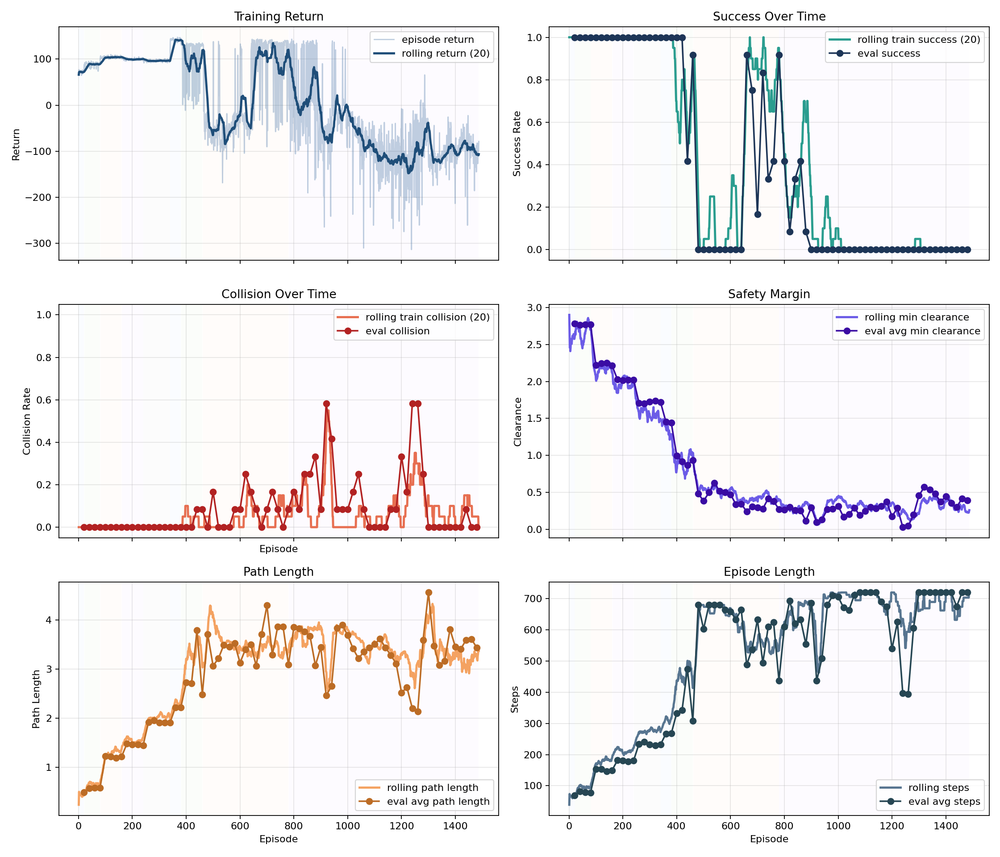
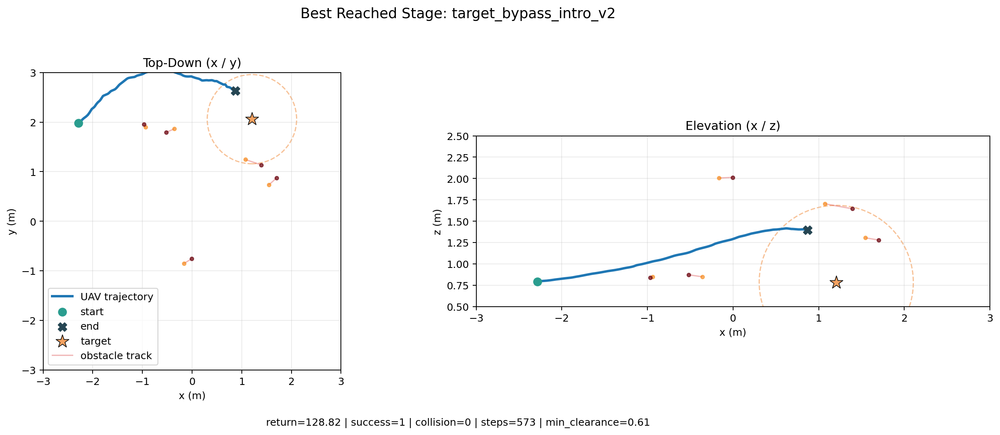
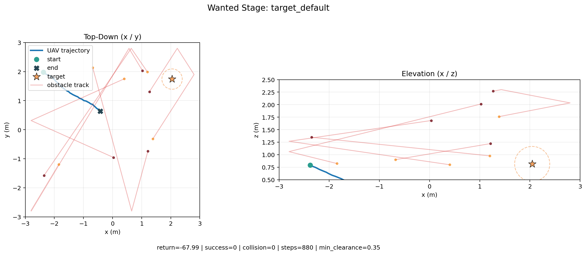

# Dynamic UAV Path Planning

Version: `1.1.2`

This project studies learning-based UAV navigation in dynamic environments. The agent sees the scene as a graph and is trained with PPO plus curriculum and teacher-guided training aids.

The repo already contains a checked-in `default.yaml` run under `checkpoints/default` and `results/default`. If you want to reproduce the same kind of outputs shown in the presentation, use the guide below.

## Quick Guide: Replicate The Presentation Results

### 1. Install

```bash
python -m venv .venv
source .venv/bin/activate
pip install --upgrade pip
pip install -r requirements.txt
pip install -e .
```

### 2. Run The Main Experiment

```bash
python scripts/train.py --config configs/default.yaml
```

You can also run:

```bash
python scripts/train.py
```

This is the main experiment used for the presentation-style results. It writes to:

- `checkpoints/default`
- `results/default/train`
- `results/default/plots`

The key plot files are:

- `results/default/plots/training_overview.png`
- `results/default/plots/evaluation_overview.png`
- `results/default/plots/training_dynamics.png`
- `results/default/plots/stage_timeline.png`

### 3. Generate The “Best Stage” And “Required Stage” Figures

```bash
python scripts/generate_stage_showcase.py \
  --config configs/default.yaml \
  --no-video
```

This creates the same style of result figures used in the presentation:

- `results/default/showcase/target_bypass_intro_v2/best_episode_2d.png`
- `results/default/showcase/target_bypass_intro_v2/best_episode_3d.png`
- `results/default/showcase/target_default/best_episode_2d.png`
- `results/default/showcase/target_default/best_episode_3d.png`
- `results/default/showcase/showcase_summary.json`

If `ffmpeg` is installed, remove `--no-video` to also export MP4 replays.

### 4. Optional: Rebuild Plots Or Re-Evaluate A Checkpoint

Rebuild the training plots from saved history:

```bash
python scripts/plot_results.py \
  --history results/default/train/history.jsonl \
  --output-dir results/default/plots
```

Run a deterministic evaluation for the main checkpoint:

```bash
python scripts/evaluate.py \
  --model checkpoints/default/best_model.pth
```

## Project In One Minute

- One UAV navigates among moving obstacles in a bounded 3D airspace.
- The environment uses PyBullet through `gym-pybullet-drones`.
- Control runs at 30 Hz and physics at 240 Hz.
- Observations are graph-structured.
- The policy is a graph-based PPO actor-critic.
- Training is helped by curriculum learning, teacher reward, behavior-cloning warm start, demo pretraining, and regression protection.

## Default Run Snapshot

The checked-in `default.yaml` run matches the main conclusion of the presentation: the policy learns meaningful intermediate navigation behavior, but it does not yet solve the hardest required stage reliably.

- Best reached stage: `target_bypass_intro_v2`
- Showcase evaluation on that stage: `11/12` successes, `1/12` collision, average return `96.79`
- Required stage: `target_default`
- Showcase evaluation on that stage: `0/12` successes, average return `-78.79`

## Selected Results

### Training Curves



The default run learns strong early and intermediate behavior, then becomes unstable as the curriculum reaches the hardest stages.

### Best Reached Stage



This is the best reached stage from the default run. It shows successful bypass behavior around moving obstacles and corresponds to the strongest stage reached in the presentation-style summary.

### Required Stage



This is the required target stage. The default run still falls short here, which is why the README and the presentation both frame the project as a strong research scaffold rather than a fully solved benchmark.
